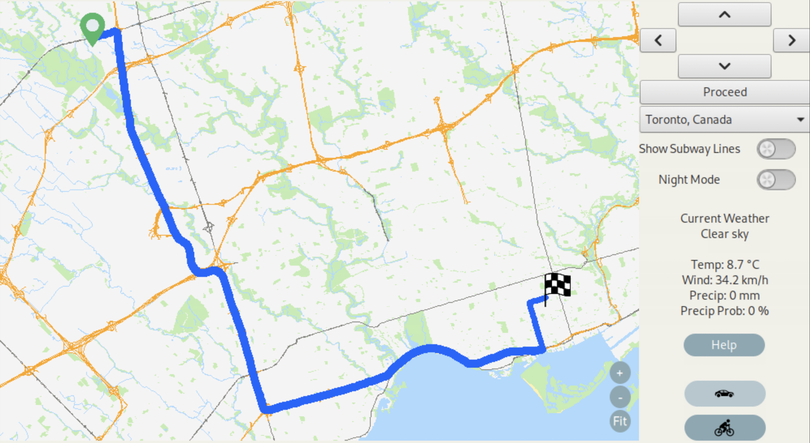
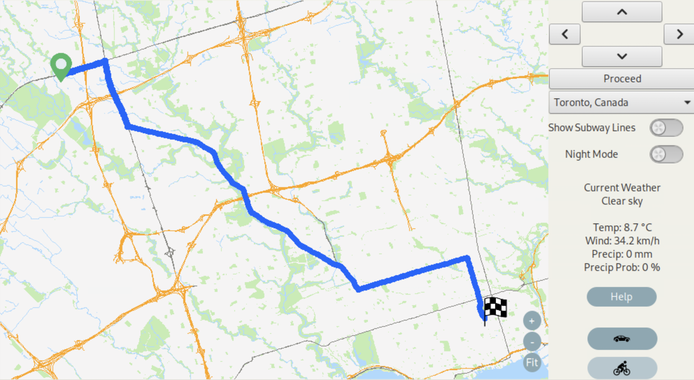
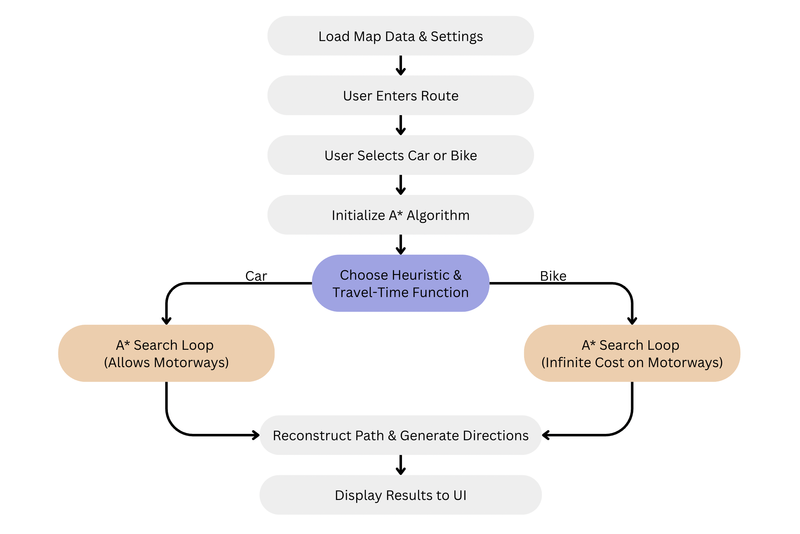
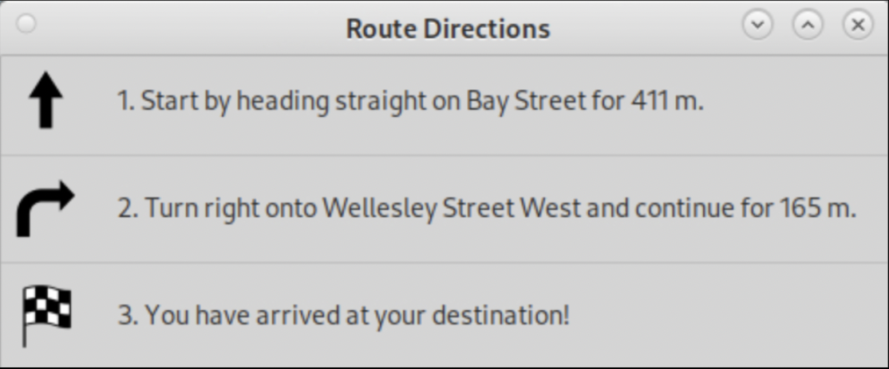
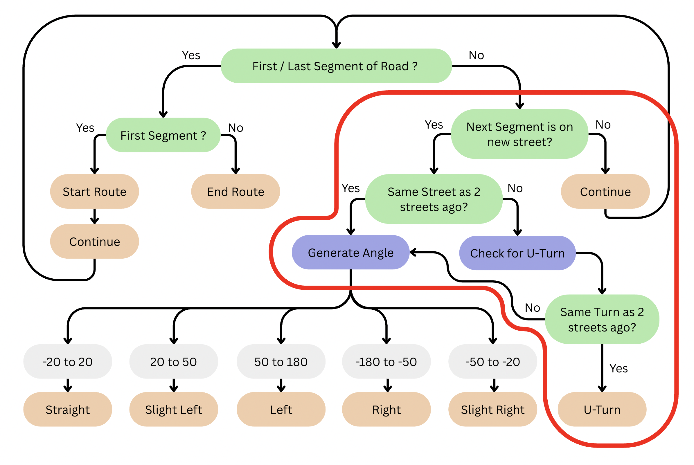

# Intelligent-Map
🚦 Creating an Intelligent Mapping &amp; Route Navigation System!

**Source Code Available Upon Demand**

This project focuses on creating an intelligent navigation system that **streamlines the modern commuter’s experience** across multiple modes of transport. The application provides optimized **car and bicycle routes**, **real-time weather updates**, and **concise navigation directions**, all in one platform.

The goal is to simplify urban commuting by integrating routing, live data, and optimization techniques into a **single, user-friendly system**.

---

## 🛠 Tech Stack / Tools
- **C++** – Core logic and algorithm implementation  
- **EZGL** - Graphics/Visualization
- **Open-Meteo API** – Real-time weather integration  
- **Multithreading** – Parallel computations for route optimization  

---

## 🚗🚴‍♂️ Features

### Car & Bicycle Routing
- Provides optimized routes tailored for both car and bicycle commuters  
- Demonstrates dynamic pathfinding via algorithmic optimization  
- **Demo available**:

**Car Routing:**  
  

**Bicycle Routing:**  
  

**Routing Implementation Flowchart:**  
  

### 🌤 Real-Time Weather Insights
- Displays **temperature, wind speed, and precipitation**  
- Powered by **live data** from the [Open-Meteo API](https://open-meteo.com/)  
- Helps commuters adjust travel plans with accurate weather forecasts  

### 🧭 Intuitive & Concise Directions
- Directions are short, clear, and commuter-friendly  
- Flow is represented in a **Directions Implementation Flowchart**

**Directions UI:**  
  

**Directions Route:**  
  

**Directions Implementation Flowchart:**  
  

---

## 📊 Travelling Salesperson Problem (TSP) Solution

The system incorporates advanced optimization techniques to solve routing problems, including the **Travelling Salesperson Problem (TSP)**.

### Approach
- **Greedy Algorithm** – baseline solution for constructing an initial path  
- **Multi-Greedy** – multiple greedy strategies to enhance starting solutions  
- **2-Opt Local Search** – iterative edge swaps to reduce total route cost  
- **Simulated Annealing** – probabilistic optimization to escape local minima  
- **Multithreading** – parallel execution of computations for efficiency  

This hybrid approach allows the system to generate **fast and near-optimal routes** within strict time constraints.
