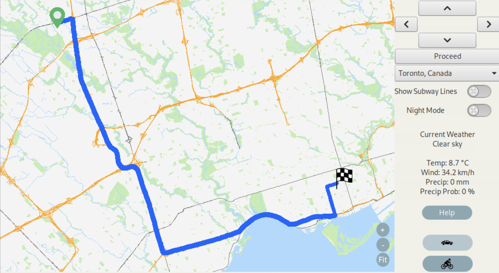
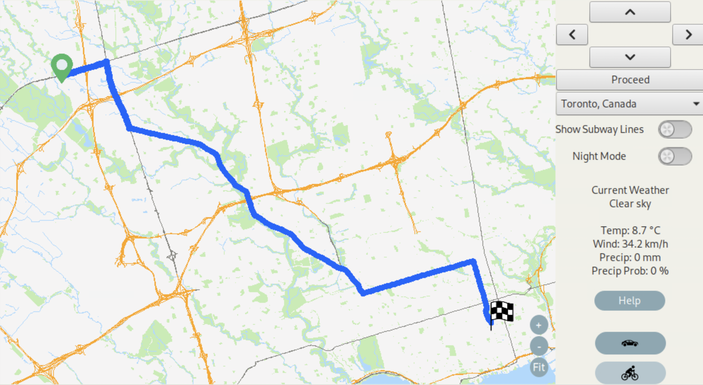
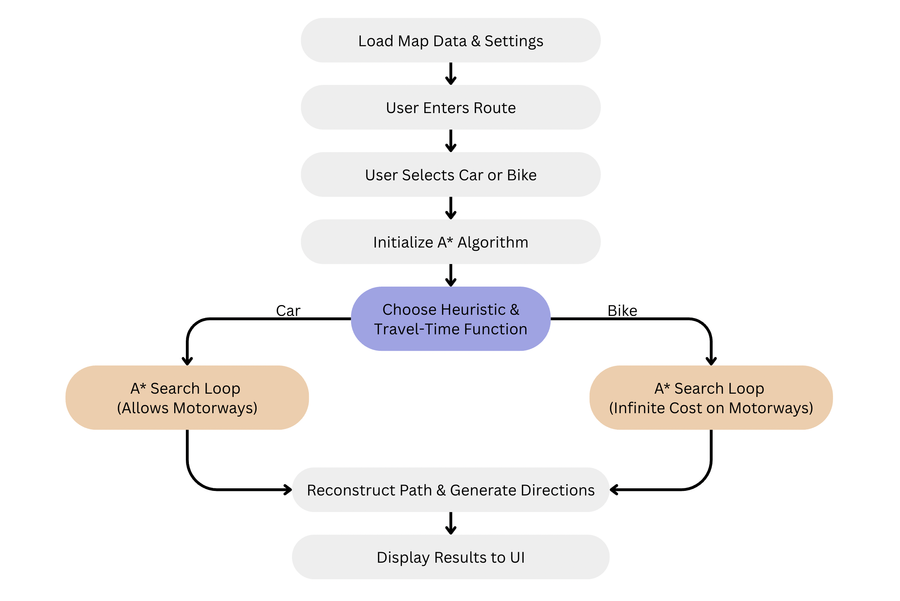
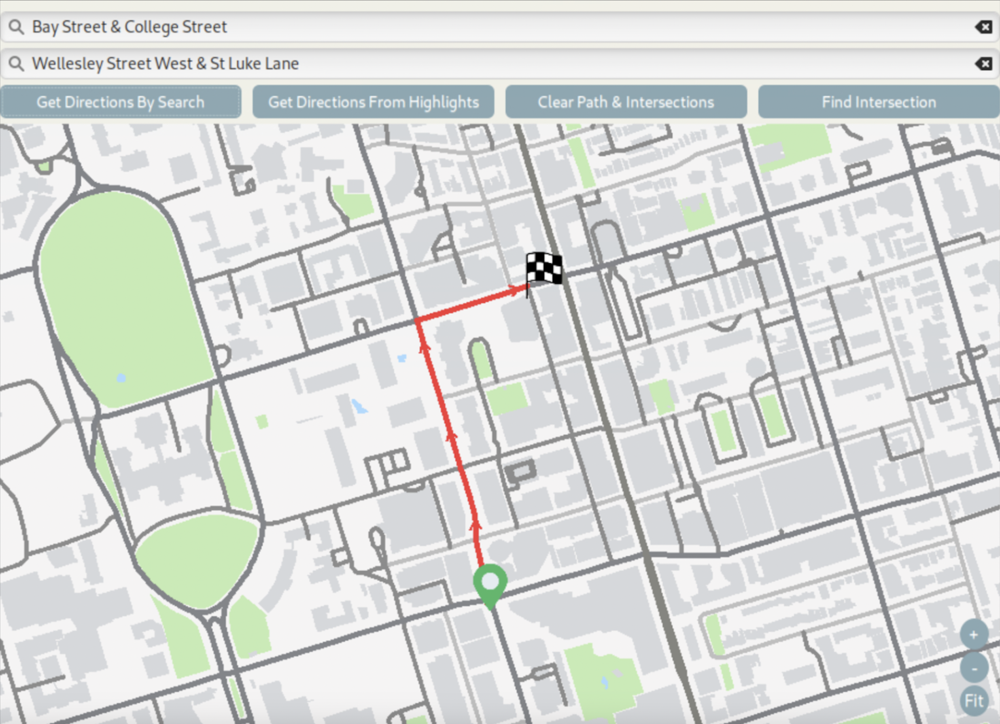
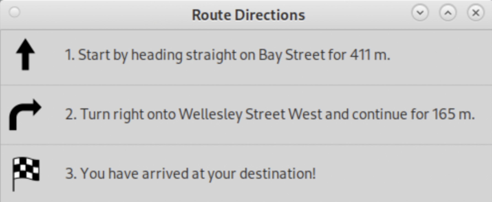
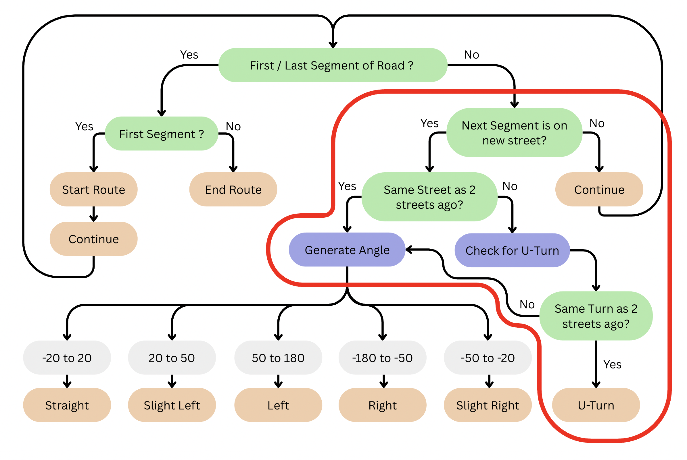

# Intelligent-Map

**Source Code Available Upon Demand**

This project demonstrates an intelligent navigation system designed for multi-modal commuting. The application provides **optimized car and bicycle routes**, **real-time weather updates**, and **concise navigation directions** within a single platform.

The system focuses on **exploring and visualizing route planning and optimization techniques**, offering a hands-on demonstration of routing algorithms and weather-aware navigation features.

---

## 🛠 Tech Stack / Tools
- **C++** – Core logic and algorithm implementation  
- **EZGL** - Graphics/Visualization
- **Open-Meteo API** – Real-time weather integration  
- **Multithreading** – Parallel computations for route optimization  

---

## 🚗🚴‍♂️ Features

### Car & Bicycle Routing
- Provides optimized routes tailored for both car and bicycle commuters  
- Demonstrates dynamic pathfinding via algorithmic optimization  
- **Demo available**:

## Car Routing

## Bicycle Routing

## Routing Implementation Flowchart

### 🌤 Real-Time Weather Insights
- Displays **temperature, wind speed, and precipitation**  
- Powered by **live data** from the [Open-Meteo API](https://open-meteo.com/)  
- Helps commuters adjust travel plans with accurate weather forecasts  

### 🧭 Intuitive & Concise Directions
- Directions are short, clear, and commuter-friendly  
- Flow is represented in a **Directions Implementation Flowchart**

## Directions UI

## Directions Route

## Directions Implementation Flowchart

---

## 📊 Travelling Salesperson Problem (TSP) Solution

The system incorporates advanced optimization techniques to solve routing problems, including the **Travelling Salesperson Problem (TSP)**.

### Approach
- **Greedy Algorithm** – baseline solution for constructing an initial path  
- **Multi-Greedy** – multiple greedy strategies to enhance starting solutions  
- **2-Opt Local Search** – iterative edge swaps to reduce total route cost  
- **Simulated Annealing** – probabilistic optimization to escape local minima  
- **Multithreading** – parallel execution of computations for efficiency  

This hybrid approach allows the system to generate **fast and near-optimal routes** within strict time constraints.
